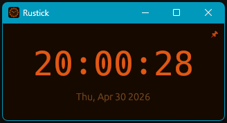
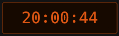
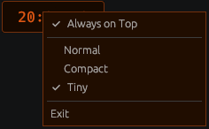

# Rustick

A lightweight always-on-top digital clock for Windows 11, built with Rust and [egui](https://github.com/emilk/egui).

## Features

- **Digital clock** — displays current time (`HH:MM:SS`) and date
- **Three display modes** switchable via right-click menu:
  - **Normal** — standard window with title bar, time and date
  - **Compact** — small borderless floating widget (230 × 65), draggable
  - **Tiny** — half-size borderless widget (116 × 36), draggable
- **Always on Top** — keeps the clock above all other windows
- **Persistent state** — window position, display mode, and always-on-top setting are saved and restored between sessions

## Screenshots

| Normal | Compact | Tiny |
|:---:|:---:|:---:|
|  |  |  |



## Usage

Right-click anywhere on the clock to open the menu:

```
     Always on Top
─────────────────────
✔  Normal
     Compact
     Tiny
─────────────────────
Exit
```

In Compact and Tiny modes the window has no title bar — click and drag anywhere on it to reposition.

## Building

Requires [Rust](https://rustup.rs) (stable).

```sh
# Debug build (console window visible)
cargo build

# Release build — optimised for size, no console window
cargo build --release
```

The release binary will be at `target/release/rustick.exe`.

### Custom icon

Place your icon files in the `assets/` directory before building:

| File | Purpose |
|---|---|
| `assets/icon.png` | Window and taskbar icon (256 × 256 recommended) |
| `assets/icon.ico` | Embedded `.exe` icon shown in Windows Explorer |

Both files are optional — the app builds and runs without them.

## License

MIT — see [LICENSE](LICENSE).
